# Stride

[](https://pkg.go.dev/github.com/TFMV/stride)
[](https://goreportcard.com/report/github.com/TFMV/stride)
[](LICENSE)

Stride is a high-performance, concurrent filesystem traversal library for Go that builds upon the standard `filepath.Walk` functionality while adding concurrency, filtering, and monitoring capabilities.

## Features

- **Concurrent Processing**: Process files in parallel with configurable worker pools
- **Flexible Filtering**: Filter files by size, extension, modification time, and permissions
- **Progress Monitoring**: Real-time statistics during traversal
- **Symlink Handling**: Configurable symlink following behavior
- **Error Handling**: Multiple strategies for handling errors during traversal
- **Memory Limits**: Set soft and hard memory limits for processing
- **Context Support**: Cancel operations with context
- **Structured Logging**: Integrated with zap logger

## Installation

```bash
go get github.com/TFMV/stride
```

## Quick Start

```go
package main

import (
    "context"
    "fmt"
    "os"
    "path/filepath"

    "github.com/TFMV/stride"
)

func main() {
    // Basic usage - similar to filepath.Walk
    err := stride.Walk(".", func(path string, info os.FileInfo, err error) error {
        if err != nil {
            return err
        }
        fmt.Println(path)
        return nil
    })
    if err != nil {
        fmt.Fprintf(os.Stderr, "Error: %v\n", err)
    }

    // Concurrent processing with 4 workers
    ctx := context.Background()
    err = stride.WalkLimit(ctx, ".", func(path string, info os.FileInfo, err error) error {
        if err != nil {
            return err
        }
        fmt.Println(path)
        return nil
    }, 4)
    if err != nil {
        fmt.Fprintf(os.Stderr, "Error: %v\n", err)
    }
}
```

## Advanced Usage

### With Filtering

```go
filter := stride.FilterOptions{
    MinSize:      1024,                // Skip files smaller than 1KB
    MaxSize:      1024 * 1024 * 10,    // Skip files larger than 10MB
    IncludeTypes: []string{".go", ".md"}, // Only process Go and Markdown files
    ExcludeDir:   []string{"vendor", "node_modules"}, // Skip these directories
    ModifiedAfter: time.Now().Add(-24 * time.Hour), // Only files modified in the last 24 hours
    MinPermissions: 0644,              // Files must be at least readable by owner and group
    MaxPermissions: 0755,              // Files must not have more permissions than rwxr-xr-x
    // Alternatively, use exact permission matching:
    // ExactPermissions: 0644,         // Match files with exactly these permissions
    // UseExactPermissions: true,      // Enable exact permission matching
}

err := stride.WalkLimitWithFilter(ctx, ".", func(path string, info os.FileInfo, err error) error {
    // Process files that pass the filter
    return nil
}, 8, filter)
```

### With Progress Reporting

```go
progressFn := func(stats stride.Stats) {
    fmt.Printf("\rProcessed: %d files, %d dirs, %.2f MB, %.2f MB/s",
        stats.FilesProcessed,
        stats.DirsProcessed,
        float64(stats.BytesProcessed) / (1024 * 1024),
        stats.SpeedMBPerSec)
}

err := stride.WalkLimitWithProgress(ctx, ".", func(path string, info os.FileInfo, err error) error {
    // Process files
    return nil
}, 8, progressFn)
```

### With Full Options

```go
opts := stride.WalkOptions{
    ErrorHandling:   stride.ErrorHandlingContinue,
    SymlinkHandling: stride.SymlinkFollow,
    LogLevel:        stride.LogLevelInfo,
    BufferSize:      8,
    Filter: stride.FilterOptions{
        MinSize:      1024,
        MaxSize:      1024 * 1024 * 10,
        IncludeTypes: []string{".go"},
    },
    Progress: func(stats stride.Stats) {
        // Report progress
    },
    MemoryLimit: stride.MemoryLimit{
        SoftLimit: 1024 * 1024 * 100, // 100MB
        HardLimit: 1024 * 1024 * 200, // 200MB
    },
}

err := stride.WalkLimitWithOptions(ctx, ".", func(path string, info os.FileInfo, err error) error {
    // Process files
    return nil
}, opts)
```

## Command Line Tool

Stride includes a powerful CLI tool for quick and efficient filesystem traversal.

```bash
# Install the command-line tool
go install github.com/TFMV/stride@latest

# Basic usage
stride /path/to/directory

# With options
stride --workers=8 --pattern="*.go" --exclude-dir="vendor,node_modules" --progress /path/to/directory

# With permission filtering
stride --min-permissions=0644 --max-permissions=0755 /path/to/directory
stride --exact-permissions=0644 /path/to/directory
```

### Available Options

```bash
--error-mode string       Error handling mode (continue|stop|skip) [default: continue]
--exact-permissions string Exact file permissions to match (octal, e.g. 0644)
--exclude-dir string      Directories to exclude (comma-separated)
--follow-symlinks         Follow symbolic links [default: false]
--format string           Output format (text|json) [default: text]
--max-permissions string  Maximum file permissions (octal, e.g. 0755)
--max-size string         Maximum file size to process
--min-permissions string  Minimum file permissions (octal, e.g. 0644)
--min-size string         Minimum file size to process
--pattern string          File pattern to match
--progress                Show progress updates
--silent                  Disable all output except errors
-v, --verbose             Enable verbose logging
-w, --workers string      Number of concurrent workers [default: 4]
```

## Architecture

```mermaid
flowchart LR
    %% Styling definitions
    classDef clientNode fill:#e1f5fe,stroke:#01579b,stroke-width:2px,color:#01579b,font-weight:bold
    classDef coreNode fill:#fff9c4,stroke:#f57f17,stroke-width:2px,color:#f57f17,font-weight:bold
    classDef optionsNode fill:#f3e5f5,stroke:#6a1b9a,stroke-width:2px,color:#6a1b9a,font-weight:bold
    classDef dataNode fill:#ffebee,stroke:#b71c1c,stroke-width:2px,color:#b71c1c,font-weight:bold
    classDef controlNode fill:#e0f7fa,stroke:#006064,stroke-width:2px,color:#006064,font-weight:bold

    %% Client and API cluster
    Client[🧑‍💻 Client Code]:::clientNode
    API[📋 Walk API]:::coreNode
    API2["Walk(), WalkLimit(), WalkLimitWithOptions()"]:::coreNode
    Client -->|Invokes| API
    API --> API2

    %% Configuration Options cluster
    subgraph Options [Configuration Options]
        Filter[🔍 Filtering\nSize, Type, Pattern]:::optionsNode
        Error[⚠️ Error Handling\nContinue, Stop, Skip]:::optionsNode
        Progress[📊 Progress Reporting\nReal-time Stats]:::optionsNode
        Symlink[🔗 Symlink Handling\nFollow, Ignore]:::optionsNode
        Memory[📏 Memory Limits\nSoft/Hard]:::optionsNode
    end

    %% Core Components cluster
    subgraph Core [Core Components]
        WP[👥 Worker Pool\nConcurrent Processing]:::coreNode
        FS[💾 File System\nDirectory Traversal]:::coreNode
        Files[📄 Files]:::dataNode
        Stats[📈 Statistics]:::dataNode
    end

    %% API relationships: it configures options and creates the worker pool.
    API -->|Configures| Filter
    API -->|Configures| Error
    API -->|Configures| Progress
    API -->|Configures| Symlink
    API -->|Configures| Memory
    API -->|Creates| WP

    %% Core relationships
    WP -->|Traverses| FS
    WP -->|Processes| Files
    WP -->|Updates| Stats
    Stats -->|Reports via| Progress

    %% Option-to-Core links
    Filter -- Determines --> Files
    Error -- Affects --> WP
    Symlink -- Configures --> FS
    Memory -- Constrains --> WP

    %% External control for cancellation
    Context[⏱️ Context\nCancellation]:::controlNode
    Context -- Controls --> WP
```



## Performance

Stride has been benchmarked with various configurations to measure its performance characteristics. Here are some key results:

### Comparison with Standard Library

Our benchmarks show interesting performance characteristics when comparing Stride with the standard library's `filepath.Walk`:

| Implementation | Time (ns/op) | Memory (B/op) | Allocations (allocs/op) |
|----------------|--------------|---------------|-------------------------|
| filepath.Walk  | 3,782,222    | 700,032       | 5,511                   |
| stride.Walk    | 6,239,953    | 1,218,906     | 6,918                   |
| stride.WalkLimit (4 workers) | 6,238,284 | 1,221,242 | 6,906          |
| stride.WalkLimit (16 workers) | 6,057,815 | 1,222,156 | 6,909         |
| stride.WalkLimit (32 workers) | 5,975,106 | 1,223,357 | 6,911         |

While the standard library's `filepath.Walk` is faster for simple traversal with no processing, Stride's value becomes apparent when:

1. **Processing files concurrently**: When actual work is performed on each file, Stride's concurrent processing provides significant speedups
2. **Filtering is needed**: Stride's built-in filtering avoids unnecessary processing
3. **Progress reporting is required**: Stride provides real-time statistics
4. **Complex error handling is needed**: Stride offers multiple error handling strategies

For CPU-bound file processing tasks, the concurrent nature of Stride can provide up to N times speedup (where N is the number of CPU cores) compared to sequential processing.


### Worker Count Impact

Increasing the number of workers can improve performance, but the optimal number depends on your specific workload and system:


### Filtering Impact

Filtering adds minimal overhead while significantly reducing the number of files processed:


| Filter Type    | Time (ns/op) | Memory (B/op) | Allocations (allocs/op) |
|----------------|--------------|---------------|-------------------------|
| No Filter      | 8,583,018    | 1,660,929     | 9,566                   |
| Extension Only | 8,510,879    | 1,660,889     | 9,566                   |
| Size Only      | 8,795,316    | 1,660,925     | 9,566                   |
| Combined       | 8,798,272    | 1,660,948     | 9,566                   |

### Progress Reporting Overhead

Progress reporting adds a small overhead:


| Progress | Time (ns/op) | Memory (B/op) | Allocations (allocs/op) |
|----------|--------------|---------------|-------------------------|
| Without  | 8,482,935    | 2,062,705     | 9,610                   |
| With     | 9,557,600    | 2,262,628     | 12,586                  |

### Core Functions Performance

The core utility functions are highly optimized:


| Function        | Time (ns/op) | Memory (B/op) | Allocations (allocs/op) |
|-----------------|--------------|---------------|-------------------------|
| filePassesFilter| 8.980        | 0             | 0                       |
| shouldSkipDir   | 10.04        | 0             | 0                       |

### Realistic Workload Performance

When performing actual file processing (reading files and computing SHA-256 hashes), Stride shows significant performance advantages:


| Implementation | Time (ns/op) | Memory (B/op) | Allocations (allocs/op) |
|----------------|--------------|---------------|-------------------------|
| filepath.Walk  | 19,446,695   | 1,010,387     | 10,515                  |
| stride.Walk    | 10,734,420   | 1,532,700     | 11,939                  |
| stride.WalkLimit (1 worker) | 23,479,985 | 1,525,112 | 11,923        |
| stride.WalkLimit (4 workers) | 12,858,610 | 1,525,640 | 11,924       |
| stride.WalkLimit (16 workers) | 10,858,304 | 1,526,309 | 11,925      |
| stride.WalkLimit (32 workers) | 11,165,940 | 1,527,260 | 11,926      |

As shown above, with realistic file processing workloads:

- Stride's basic `Walk` function is ~45% faster than the standard library
- Stride's concurrent implementation with 16 workers is ~44% faster than the standard library
- The optimal worker count depends on the specific workload and system

## Testing

Stride includes comprehensive test coverage:

- Unit tests for all core functions
- Integration tests for end-to-end functionality
- Edge case tests for error handling, symlinks, etc.
- Benchmarks for performance measurement

Run the tests with:

```bash
go test ./...
```

Run benchmarks with:

```bash
go test -bench=. -benchmem ./...
```

## License

This project is licensed under the MIT License - see the [LICENSE](LICENSE) file for details.
